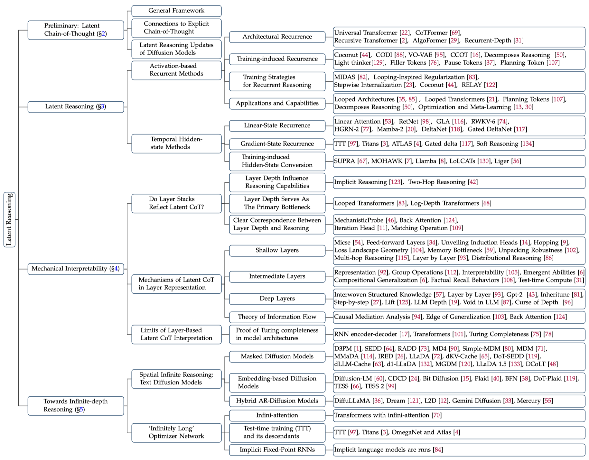
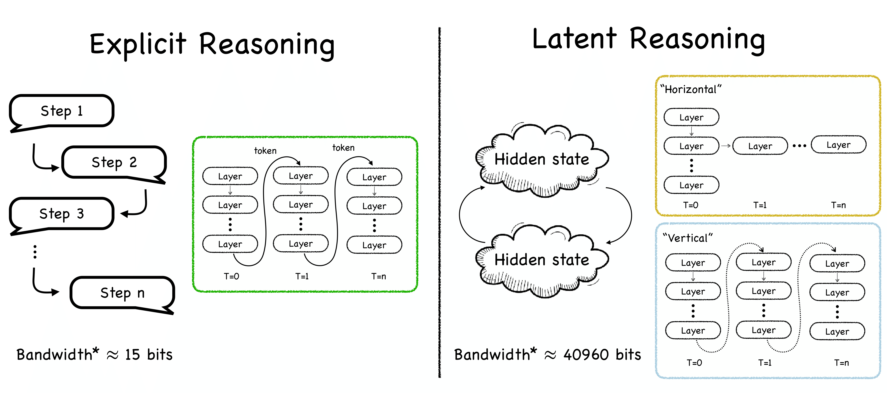

<div align=center>
 
</div>
<h2 align="center">
  <a href="https://arxiv.org/abs/2507.06203">🔥🔥🔥 LatentCoT-Horizon</a>
</h2>
<p align="center">
  If you like our project, please give us a star ⭐ on GitHub for the latest update.
</p>
<h5 align="center">

[](https://awesome.re)
[](https://arxiv.org/abs/2507.06203) 
[](https://huggingface.co/papers/2507.06203)
[](https://x.com/omarsar0/status/1942976772724695513?s=46)
[](https://x.com/RidgerZhu/status/1942759773986021647)
[](https://github.com/multimodal-art-projection/LatentCoT-Horizon/pulls)
[](https://github.com/multimodal-art-projection/LatentCoT-Horizon)

</h5>


This repository provides the papers mentioned in the survey "<a href="https://arxiv.org/abs/2507.06203">A Survey on Latent Reasoning</a>".

<div align=center>
 
</div>

## 📑 Citation

If you find our survey useful for your research, please consider citing the following paper:

```bibtex
@article{map2025latent,
  title={A Survey on Latent Reasoning},
  author={M-A-P},
  journal={arxiv},
  year={2025}
}
```

## 📣 Update News

`[2025-07-08]` We have released the arxiv: <a href="https://arxiv.org/abs/2507.06203">A Survey on Latent Reasoning</a>. 

`[2025-07-04]` We have initialed the repository.

## 🆚 Explicit Reasoning vs. Latent Reasoning
<div align=center>
 
</div>

## ⚡ Contributing

We welcome feedback, suggestions, and contributions that can help improve this survey and repository and make them valuable resources for the entire community.
We will actively maintain this repository by incorporating new research as it emerges. If you have any suggestions about our taxonomy, please take a look at any missed papers or update any preprint arXiv papers that have been accepted to some venue.

 If you want to add your work or model to this list, please do not hesitate to email ridger@ucsc.edu or [pull requests]([https://github.com/multimodal-art-projection/LatentCoT-Horizon/pulls](https://github.com/multimodal-art-projection/LatentCoT-Horizon/pulls)). 
 
 Markdown format:

```markdown
* | **Paper Name** | Name of Conference or Journal + Year | Release Date | [Paper](link) - [Code](link) |
```


## 💼 Contents

- [📑 Citation](#-citation)
- [📣 Update News](#-update-news)
- [🆚 Explict Reasoning vs. Latent Reasoning](#-explict-reasoning-vs-latent-reasoning)
- [💼 Contents](#-contents)
- [📜 Papers](#-papers)
  - [🧠 Latent CoT Reasoning](#-latent-cot-reasoning)
    - [🔄 Activation-based Recurrent Methods](#-activation-based-recurrent-methods)
      - [🧱 Architectural Recurrence](#-architectural-recurrence)
      - [🏋️ Training-induced Recurrence](#️-training-induced-recurrence)
      - [🎯 Training Strategies for Recurrent Reasoning](#-training-strategies-for-recurrent-reasoning)
      - [✨ Applications and Capabilities](#-applications-and-capabilities)
    - [⏳ Temporal Hidden-state Methods](#-temporal-hidden-state-methods)
      - [📦 Hidden-state based methods](#-hidden-state-based-methods)
      - [⚙️ Optimization-based State Evolution](#️-optimization-based-state-evolution)
      - [🎭 Training-induced Hidden-State Conversion](#-training-induced-hidden-state-conversion)
  - [🔬 Mechanistic Interpretability](#-mechanistic-interpretability)
    - [🧐 Do Layer Stacks Reflect Latent CoT?](#-do-layer-stacks-reflect-latent-cot)
    - [🛠️ Mechanisms of Latent CoT in Layer Representation](#️-mechanisms-of-latent-cot-in-layer-representation)
    - [💻 Turing Completeness of Layer-Based Latent CoT](#-turing-completeness-of-layer-based-latent-cot)
  - [♾️ Towards Infinite-depth Reasoning](#️-towards-infinite-depth-reasoning)
    - [🌀 Spatial Infinite Reasoning: Text Diffusion Models](#-spatial-infinite-reasoning-text-diffusion-models)
      - [⬛ Masked Diffusion Models (Temporal-only)](#-masked-diffusion-models-temporal-only)
      - [⬛ Masked Diffusion Models (With Cache)](#-masked-diffusion-models-with-cache)
      - [🔗 Embedding-based Diffusion Models](#-embedding-based-diffusion-models)
      - [🧬 Hybrid AR-Diffusion Models](#-hybrid-ar-diffusion-models)
    - [🕸️ Towards an 'Infinitely Long' Optimiser Network](#️-towards-an-infinitely-long-optimiser-network)
    - [📌 Implicit Fixed Point RNNs](#-implicit-fixed-point-rnns)
    - [💬 Discussion](#-discussion)
- [👍 Acknowledgement](#-acknowledgement)
- [♥️ Contributors](#️-contributors)


## 📜 Papers


### 🧠 Latent CoT Reasoning

___

#### 🔄 Activation-based Recurrent Methods

##### 🧱 Architectural Recurrence

| Title                                                        | Venue     | Date             | Links                                                        |
| ------------------------------------------------------------ |---------- | ---------------- | ------------------------------------------------------------ |
| **Universal transformers** | ICLR 2019 | Jul 2018 | [Paper](https://arxiv.org/abs/1807.03819) - [Code](https://github.com/andreamad8/Universal-Transformer-Pytorch) |
| **CoTFormer: A Chain-of-Thought Driven Architecture with Budget-Adaptive Computation Cost at Inference** |ICLR 2025 | Oct 2023 | [Paper](https://arxiv.org/abs/2310.10845) |
| **AlgoFormer: An Efficient Transformer Framework with Algorithmic Structures** |TMLR 2025 | Feb 2024 | [Paper](https://arxiv.org/abs/2402.13572) - [Code](https://github.com/chuanyang-Zheng/Algoformer)|
| **Relaxed recursive transformers: Effective parameter sharing with layer-wise Lora** |ICLR 2025 | Oct 2024 | [Paper](https://arxiv.org/abs/2410.20672) |
| **Scaling up Test-Time Compute with Latent Reasoning: A Recurrent Depth Approach** |ICLR 2025 | Feb 2025 | [Paper](https://arxiv.org/abs/2502.05171) - [Code](https://github.com/seal-rg/recurrent-pretraining)|
| **Pretraining Language Models to Ponder in Continuous Space** |arXiv | May 2025 | [Paper](https://arxiv.org/abs/2505.20674) - [Code](https://github.com/LUMIA-Group/PonderingLM) |
| **Mixture-of-Recursions: Learning Dynamic Recursive Depths for Adaptive Token-Level Computation** |arXiv | Jul 2025 | [Paper](https://arxiv.org/pdf/2507.10524) - [Code](https://github.com/raymin0223/mixture_of_recursions) |

##### 🏋️ Training-induced Recurrence
| Title | Venue | Date | Links |
| --- | --- | --- | --- |
| **Think before you speak: Training Language Models With Pause Tokens** | ICLR 2024 | Oct 2023 | [Paper](https://arxiv.org/abs/2310.02226) |
| **Guiding Language Model Reasoning with Planning Tokens** | COLM 2024 | Oct 2023 | [Paper](https://arxiv.org/abs/2310.05707) - [Code](https://github.com/WANGXinyiLinda/planning_tokens) |
| **Let's Think Dot by Dot: Hidden computation in transformer language models** | COLM 2024 | Apr 2024 | [Paper](https://arxiv.org/abs/2404.15758) - [Code](https://github.com/JacobPfau/fillerTokens) |
| **Disentangling memory and reasoning ability in large language models** | ACL 2025 (main) | Nov 2024 | [Paper](https://arxiv.org/abs/2411.13504) - [Code](https://github.com/MingyuJ666/Disentangling-Memory-and-Reasoning) |
| **Training large language models to reason in a continuous latent space** | arXiv | Dec 2024 | [Paper](https://arxiv.org/abs/2412.06769) - [Code](https://github.com/facebookresearch/coconut) |
| **Compressed chain of thought: Efficient reasoning through dense representations** | arXiv | Dec 2024 | [Paper](https://arxiv.org/abs/2412.13171) |
| **Multimodal Latent Language Modeling with Next-Token Diffusion**| arXiv | Dec 2024 | [Paper](https://arxiv.org/pdf/2412.08635) - [Page](https://thegenerality.com/agi/research.html)|
| **Efficient Reasoning with Hidden Thinking** | arXiv | Jan 2025 | [Paper](https://arxiv.org/pdf/2501.19201) - [Code](https://github.com/shawnricecake/Heima) |
| **Token Assorted: Mixing Latent and Text Tokens for Improved Language Model Reasoning** | ICML 2025 | Feb 2025 | [Paper](https://arxiv.org/abs/2502.03275) |
| **Lightthinker: Thinking step-by-step compression** | arXiv | Feb 2025 | [Paper](https://arxiv.org/abs/2502.15589) - [Code](https://github.com/zjunlp/LightThinker) |
| **Codi: Compressing chain-of-thought into continuous space via self-distillation** | arXiv | Feb 2025 | [Paper](https://arxiv.org/abs/2502.21074) - [Code](https://github.com/guanziju/Open_CODI) |
| **System-1.5 Reasoning: Traversal in Language and Latent Spaces with Dynamic Shortcuts** | arXiv | May 2025 | [Paper](https://arxiv.org/abs/2505.18962) |
| **Hybrid Latent Reasoning via Reinforcement Learning** | arXiv | May 2025 | [Paper](https://arxiv.org/pdf/2505.18454) - [Code](https://github.com/Yueeeeeeee/HRPO)|
| **Machine Mental Imagery: Empower Multimodal Reasoning with Latent Visual Tokens** | arXiv | Jun 2025 | [Paper](https://www.arxiv.org/abs/2506.17218) - [Code](https://github.com/UMass-Embodied-AGI/Mirage) |
| **Parallel Continuous Chain-of-Thought with Jacobi Iteration** | arXiv | Jun 2025 | [Paper](https://arxiv.org/abs/2506.18582) - [Code](https://github.com/whyNLP/PCCoT) |
| **Think Silently, Think Fast: Dynamic Latent Compression of LLM Reasoning Chains** | arXiv | Jun 2025 | [Paper](https://arxiv.org/pdf/2505.16552) - [Code](https://github.com/xiaomi-research/colar) |


##### 🎯 Training Strategies for Recurrent Reasoning

| Title | Venue | Date | Links |
| --- | --- | --- | --- |
| **From explicit cot to implicit cot: Learning to internalize cot step by step** | arXiv | May 2024 | [Paper](https://arxiv.org/abs/2405.14838) |
| **On the inductive bias of stacking towards improving reasoning** | NeurIPS 2024 | Jun 2024 | [Paper](https://arxiv.org/abs/2406.03149) |
| **Language Models are Hidden Reasoners: Unlocking Latent Reasoning Capabilities via Self-Rewarding** | arXiv | Nov 2024 | [Paper](https://arxiv.org/abs/2411.04282) - [Code](https://github.com/SalesforceAIResearch/LaTRO) |
| **Training large language models to reason in a continuous latent space** | arXiv | Dec 2024 | [Paper](https://arxiv.org/abs/2412.06769) |
| **Enhancing Auto-regressive Chain-of-Thought through Loop-Aligned Reasoning** | arXiv | Feb 2025 | [Paper](https://arxiv.org/abs/2502.08482) |
| **Reasoning with latent thoughts: On the power of looped transformers** | arXiv | Feb 2025 | [Paper](https://arxiv.org/abs/2502.17416) |
| **Seek in the Dark: Reasoning via Test-Time Instance-Level Policy Gradient in Latent Space** | arXiv | May 2025 | [Paper](https://arxiv.org/pdf/2505.13308?) - [Code](https://github.com/bigai-nlco/LatentSeek) - [Project](https://bigai-nlco.github.io/LatentSeek/) |


##### ✨ Applications and Capabilities

| Title | Venue | Date | Links |
| --- | --- | --- | --- |
| **Can you learn an algorithm? generalizing from easy to hard problems with recurrent networks** | NeurIPS 2021 | Oct 2021 | [Paper](https://arxiv.org/abs/2110.11112) - [Code](https://github.com/tolga-ertugrul/learning-an-algorithm) |
| **Looped transformers as programmable computers** | ICML 2023 | Jun 2023 | [Paper](https://arxiv.org/abs/2306.08022) - [Code](https://github.com/giannou/looped-transformers) |
| **Simulation of graph algorithms with looped transformers** | arXiv | Feb 2024 | [Paper](https://arxiv.org/abs/2402.01107) - [Code](https://github.com/ADeLuca99/Looped-Transformers-on-Graphs)|
| **Guiding Language Model Reasoning with Planning Tokens** | CoLM 2024 | Feb 2024 | [Paper](https://arxiv.org/abs/2402.06634) - [Code](https://github.com/Xinyi-Wang-dot/Planning-Tokens) |
| **Can looped transformers learn to implement multi-step gradient descent for in-context learning?** | arXiv | Oct 2024 | [Paper](https://arxiv.org/abs/2410.08292) |
| **Bypassing the exponential dependency: Looped transformers efficiently learn in-context by multi-step gradient descent** | arXiv | Oct 2024 | [Paper](https://arxiv.org/abs/2410.11268) |
| **Disentangling memory and reasoning ability in large language models** | arXiv | Nov 2024 | [Paper](https://arxiv.org/abs/2411.13504) |

___

#### ⏳ Temporal Hidden-state Methods

##### 📦 Hidden-state based methods
| Title | Venue | Date | Links |
| --- | --- | --- | --- |
| **Gated linear attention transformers with hardware-efficient training** | arXiv | Dec 2023 | [Paper](https://arxiv.org/abs/2312.06635) - [Code](https://github.com/fla-org/flash-linear-attention) ||
| **Eagle and finch: Rwkv with matrix-valued states and dynamic recurrence** | arXiv | Apr 2024 | [Paper](https://arxiv.org/abs/2404.05892) - [Code](https://github.com/BlinkDL/RWKV-LM) |
| **Hgrn2: Gated linear rnns with state expansion** | arXiv | Apr 2024 | [Paper](https://arxiv.org/abs/2404.07904) - [Code](https://github.com/fla-org/flash-linear-attention) |
| **Transformers are ssms: Generalized models and efficient algorithms through structured state space duality** | arXiv | May 2024 | [Paper](https://arxiv.org/abs/2405.21060) - [Code](https://github.com/state-spaces/mamba) |
| **Parallelizing linear transformers with the delta rule over sequence length** | arXiv | Jun 2024 | [Paper](https://arxiv.org/abs/2406.06484) - [Code](https://github.com/fla-org/flash-linear-attention) |

##### ⚙️ Optimization-based State Evolution
| Title | Venue | Date | Links |
| --- | --- | --- | --- |
| **Learning to (learn at test time): Rnns with expressive hidden states** | arXiv | Jul 2024 | [Paper](https://arxiv.org/abs/2407.04620) |
| **Gated Delta Networks: Improving Mamba2 with Delta Rule** | arXiv | Dec 2024 | [Paper](https://arxiv.org/abs/2412.06464) - [Code](https://github.com/fla-org/flash-linear-attention) |
| **Titans: Learning to memorize at test time** | arXiv | Jan 2025 | [Paper](https://arxiv.org/abs/2501.00663) |
| **Lattice: Learning to efficiently compress the memory** | arXiv | Apr 2025 | [Paper](https://arxiv.org/abs/2504.05646) |
| **It's All Connected: A Journey Through Test-Time Memorization, Attentional Bias, Retention, and Online Optimization** | arXiv | Apr 2025 | [Paper](https://arxiv.org/abs/2504.13173) |
| **Atlas: Learning to optimally memorize the context at test time** | arXiv | May 2025 | [Paper](https://arxiv.org/abs/2505.23735) |
| **Soft Reasoning: Navigating Solution Spaces in Large Language Models through Controlled Embedding Exploration** | arXiv | May 2025 | [Paper](https://arxiv.org/abs/2505.24688) |

##### 🎭 Training-induced Hidden-State Conversion
| Title | Venue | Date | Links |
| --- | --- | --- | --- |
| **Linearizing large language models** | arXiv | May 2024 | [Paper](https://arxiv.org/abs/2405.06640) |
| **Transformers to ssms: Distilling quadratic knowledge to subquadratic models** | NeurIPS 2024 | Jun 2024 | [Paper](https://arxiv.org/abs/2406.01289) |
| **LoLCATs: On Low-Rank Linearizing of Large Language Models** | ICLR 2025 | Oct 2024 | [Paper](https://arxiv.org/abs/2410.10254) |
| **Llamba: Scaling Distilled Recurrent Models for Efficient Language Processing** | arXiv | Feb 2025 | [Paper](https://arxiv.org/abs/2502.14458) - [Code](https://github.com/HazyResearch/lolcats) |
| **Liger: Linearizing Large Language Models to Gated Recurrent Structures** | arXiv | Mar 2025 | [Paper](https://arxiv.org/abs/2503.01496) - [Code](https://github.com/OpenSparseLLMs/Linearization) |
| **Flexible Language Modeling in Continuous Space with Transformer-based Autoregressive Flows** | arXiv | Jul 2025 | [Paper](https://arxiv.org/pdf/2507.00425) |

### 🔬 Mechanistic Interpretability

___

#### 🧐 Do Layer Stacks Reflect Latent CoT?
| Title | Venue | Date | Links |
| --- | --- | --- | --- |
| **Towards a mechanistic interpretation of multi-step reasoning capabilities of language models** | arXiv | Oct 2023 | [Paper](https://arxiv.org/abs/2310.14491) - [Code](https://github.com/yifan-h/MechanisticProbe)|
| **Iteration head: A mechanistic study of chain-of-thought** | NeurIPS 2024 | Jun 2024 | [Paper](https://arxiv.org/abs/2406.02128) |
| **Towards understanding how transformer perform multi-step reasoning with matching operation** | arXiv | Jun 2024 | [Paper](https://arxiv.org/abs/2405.15302v1) |
| **Do LLMs Really Think Step-by-step In Implicit Reasoning?** | arXiv | Nov 2024 | [Paper](https://arxiv.org/abs/2411.15862) |
| **Back attention: Understanding and enhancing multi-hop reasoning in large language models** | arXiv | Feb 2025 | [Paper](https://arxiv.org/abs/2502.10835) |
| **How Do LLMs Perform Two-Hop Reasoning in Context?** | arXiv | Feb 2025 | [Paper](https://arxiv.org/abs/2502.13913) |
| **Reasoning with latent thoughts: On the power of looped transformers** | arXiv | Feb 2025 | [Paper](https://arxiv.org/abs/2502.17416) |
| **A little depth goes a long way: The expressive power of log-depth transformers** | arXiv | Mar 2025 | [Paper](https://arxiv.org/abs/2503.03961) |
| **Latent Chain-of-Thought? Decoding the Depth-Recurrent Transformer** | arXiv | Jul 2025 | [Paper](https://arxiv.org/abs/2507.02199) - [Code](https://github.com/wenquanlu/huginn-latent-cot) |
___

#### 🛠️ Mechanisms of Latent CoT in Layer Representation
| Title | Venue | Date | Links |
| --- | --- | --- | --- |
| **Enhancing the locality and breaking the memory bottleneck of transformer on time series forecasting** | NeurIPS 2019 | Jul 2019 | [Paper](https://arxiv.org/abs/1907.00235) |
| **Transformer feed-forward layers are key-value memories** | EMNLP 2021 | Dec 2020 | [Paper](https://arxiv.org/abs/2012.14913) |
| **Interpretability in the wild: a circuit for indirect object identification in GPT-2 small** | arXiv | Nov 2022 | [Paper](https://arxiv.org/abs/2211.00593)  |
| **micse: Mutual information contrastive learning for low-shot sentence embeddings** | arXiv | Nov 2022 | [Paper](https://arxiv.org/abs/2211.04928) - [Code](https://github.com/SAP-samples/acl2023-micse/) |
| **How does GPT-2 compute greater-than?: Interpreting mathematical abilities in a pre-trained language model** | NeurIPS 2023 | May 2023 | [Paper](https://arxiv.org/abs/2305.00586) |
| **A mechanistic interpretation of arithmetic reasoning in language models using causal mediation analysis** | EMNLP 2023 | May 2023 | [Paper](https://arxiv.org/abs/2305.15054) - [Code](https://github.com/alestolfo/lm-arithmetic) |
| **Why lift so heavy? slimming large language models by cutting off the layers** | arXiv | Feb 2024 | [Paper](https://arxiv.org/abs/2402.11700) |
| **Do large language models latently perform multi-hop reasoning?** | EACL 2024 | Feb 2024 | [Paper](https://arxiv.org/abs/2402.16837) |
| **Understanding and Patching Compositional Reasoning in LLMs** | ACL 2024 (Finding) | Feb 2024 | [Paper](https://arxiv.org/abs/2402.14328) - [Code](https://github.com/Zhaoyi-Li21/creme) |
| **How to think step-by-step: A mechanistic understanding of chain-of-thought reasoning** | ICLR 2024 | Feb 2024 | [Paper](https://arxiv.org/abs/2402.18312) |
| **The Unreasonable Ineffectiveness of the Deeper Layers** | arXiv | Mar 2024 | [Paper](https://arxiv.org/abs/2403.17887) |
| **Inheritune: Training Smaller Yet More Attentive Language Models** | arXiv | Apr 2024 | [Paper](https://arxiv.org/abs/2404.08634v2) - [Code](https://github.com/sanyalsunny111/LLM-Inheritune) |
| **Grokked transformers are implicit reasoners: A mechanistic journey to the edge of generalization** | ICML 2024 | May 2024 | [Paper](https://arxiv.org/abs/2405.15071) - [Code](https://github.com/OSU-NLP-Group/GrokkedTransformer) |
| **Embedding Trajectory for Out-of-Distribution Detection in Mathematical Reasoning** | NeurIPS 2024 | May 2024 | [Paper](https://arxiv.org/abs/2405.14039) - [Code](https://github.com/Alsace08/OOD-Math-Reasoning) |
| **Loss landscape geometry reveals stagewise development of transformers** | Hi-DL 2024 | Jun 2024 | [Paper](https://arxiv.org/abs/2402.02364v2) |
| **Hopping too late: Exploring the limitations of large language models on multi-hop queries** | arXiv | Jun 2024 | [Paper](https://arxiv.org/abs/2406.12775) |
| **Distributional reasoning in llms: Parallel reasoning processes in multi-hop reasoning** | arXiv | Jun 2024 | [Paper](https://arxiv.org/abs/2406.13858) |
| **Unveiling Factual Recall Behaviors of Large Language Models through Knowledge Neurons** | arXiv | Aug 2024 | [Paper](https://arxiv.org/abs/2408.03247) |
| **Unveiling induction heads: Provable training dynamics and feature learning in transformers** | arXiv | Sep 2024 | [Paper](https://arxiv.org/abs/2409.10559) |
| **Investigating layer importance in large language models** | arXiv | Sep 2024 | [Paper](https://arxiv.org/abs/2409.14381) |
| **Unifying and Verifying Mechanistic Interpretations: A Case Study with Group Operations** | arXiv | Oct 2024 | [Paper](https://arxiv.org/abs/2410.07476v2) - [Code](https://github.com/willy-wu/unified_circuits) |
| **Understanding Layer Significance in LLM Alignment** | arXiv | Oct 2024 | [Paper](https://arxiv.org/abs/2410.17875) |
| **Latent Space Chain-of-Embedding Enables Output-free LLM Self-Evaluation** | ICLR 2025 | Oct 2024 | [Paper](https://arxiv.org/abs/2410.13640) - [Code](https://github.com/Alsace08/Chain-of-Embedding) |
| **Does representation matter? exploring intermediate layers in large language models** | arXiv | Dec 2024 | [Paper](https://arxiv.org/abs/2412.09563) |
| **Layer by Layer: Uncovering Hidden Representations in Language Models** | ICML 2025 (oral) | Feb 2025 | [Paper](https://arxiv.org/abs/2502.02013) - [Code](https://github.com/OFSkean/information_flow)|
| **Scaling up Test-Time Compute with Latent Reasoning: A Recurrent Depth Approach** | arXiv | Feb 2025 | [Paper](https://arxiv.org/abs/2502.05171) - [Code](https://github.com/seal-rg/recurrent-pretraining) |
| **The Curse of Depth in Large Language Models** | arXiv | Feb 2025 | [Paper](https://arxiv.org/abs/2502.05795) - [Code](https://github.com/lmsdss/LayerNorm-Scaling) |
| **Back attention: Understanding and enhancing multi-hop reasoning in large language models** | arXiv | Feb 2025 | [Paper](https://arxiv.org/abs/2502.10835) |
| **The Representation and Recall of Interwoven Structured Knowledge in LLMs: A Geometric and Layered Analysis** | arXiv | Feb 2025 | [Paper](https://arxiv.org/abs/2502.10871) |
| **An explainable transformer circuit for compositional generalization** | arXiv | Feb 2025 | [Paper](https://arxiv.org/abs/2502.15801) |
| **Emergent Abilities in Large Language Models: A Survey** | arXiv | Mar 2025 | [Paper](https://arxiv.org/abs/2503.05788) |
| **Unpacking Robustness in Inflectional Languages: Adversarial Evaluation and Mechanistic Insights** | arXiv | May 2025 | [Paper](https://arxiv.org/abs/2505.07856) |
| **Do Language Models Use Their Depth Efficiently?** | arXiv | May 2025 | [Paper](https://arxiv.org/abs/2505.13898) |
| **Void in Language Models** | arXiv | May 2025 | [Paper](https://arxiv.org/abs/2505.14467) |
___

#### 💻 Turing Completeness of Layer-Based Latent CoT
| Title | Venue | Date | Links |
| --- | --- | --- | --- |
| **On the computational power of neural nets** | JCSS | 1995 | [Paper](https://www.sciencedirect.com/science/article/pii/S0022000085710136) |
| **Long Short-Term Memory** | Neural Computation | 1997 | [Paper](https://doi.org/10.1162/neco.1997.9.8.1735) |
| **Learning Phrase Representations using RNN Encoder-Decoder for Statistical Machine Translation** | EMNLP 2014 | Jun 2014 | [Paper](https://arxiv.org/abs/1406.1078) |
| **On the turing completeness of modern neural network architectures** | IJCNN 2021 | Jan 2019 | [Paper](https://arxiv.org/abs/1901.03429) |
| **Recurrent memory transformer** | NeurIPS 2022 | Jul 2022 | [Paper](https://arxiv.org/abs/2207.06881) |
| **Looped transformers as programmable computers** | ICML 2023 | Jun 2023 | [Paper](https://arxiv.org/abs/2301.13196) |
| **On limitations of the transformer architecture** | CoLM 2024 | Nov 2023 | [Paper](https://arxiv.org/abs/2402.08164) |
| **Investigating Recurrent Transformers with Dynamic Halt** | arXiv | Feb 2024 | [Paper](https://arxiv.org/abs/2402.00976) |
| **Chain of thought empowers transformers to solve inherently serial problems** | ICLR 2024 | Feb 2024 | [Paper](https://arxiv.org/abs/2402.12875) |
| **Quiet-star: Language models can teach themselves to think before speaking** | arXiv | Mar 2024 | [Paper](https://arxiv.org/abs/2403.09629) |
| **Ask, and it shall be given: On the Turing completeness of prompting** | arXiv | Nov 2024 | [Paper](https://arxiv.org/abs/2411.01992) |
| **Reinforcement Pre-Training** | arXiv | Jun 2025 | [Paper](https://arxiv.org/abs/2506.08007) |
| **Constant Bit-size Transformers Are Turing Complete** | arXiv | Jun 2025 | [Paper](https://arxiv.org/abs/2506.12027) |
| **Reasoning by Superposition: A Theoretical Perspective on Chain of Continuous Thought** | arXiv | Jul 2025 | [Paper](https://arxiv.org/pdf/2505.12514) - [Code](https://github.com/Ber666/reasoning-by-superposition) |

### ♾️ Towards Infinite-depth Reasoning

___

#### 🌀 Spatial Infinite Reasoning: Text Diffusion Models

##### ⬛ Masked Diffusion Models (Temporal-only)
| Title | Venue | Date | Links |
| --- | --- | --- | --- |
| **Structured denoising diffusion models in discrete state-spaces** | NeurIPS 2021 | Jul 2021 | [Paper](https://arxiv.org/abs/2107.03006) |
| **Discrete diffusion modeling by estimating the ratios of the data distribution** | ICML 2024 | June 2024 | [Paper](https://arxiv.org/pdf/2310.16834) |
| **Your absorbing discrete diffusion secretly models the conditional distributions of clean data** | arXiv | Jun 2024 | [Paper](https://arxiv.org/abs/2406.03736) |
| **Learning Iterative Reasoning through Energy Diffusion** | ICML 2024 | Jun 2024 | [Paper](https://arxiv.org/pdf/2406.11179) - [Project](https://energy-based-model.github.io/ired) |
| **Simplified and generalized masked diffusion for discrete data** | NeurIPS 2024 | Jun 2024 | [Paper](https://arxiv.org/pdf/2406.04329) -[Project](https://github.com/google-deepmind/md4) |
| **Simple and effective masked diffusion language models** | NeurIPS 2024 | Jun 2024 | [Paper](https://arxiv.org/abs/2406.19509) - [Code](https://github.com/ssahoo04/MDLM) |
| **Scaling up Masked Diffusion Models on Text** | arXiv | Oct 2024 | [Paper](https://arxiv.org/pdf/2406.07524) - [Project](https://s-sahoo.com/mdlm) |
| **Mmada: Multimodal large diffusion language models** | arXiv | May 2025 | [Paper](https://arxiv.org/pdf/2505.15809) - [Project](https://github.com/Gen-Verse/MMaDA/) |

##### ⬛ Masked Diffusion Models (With Cache)
| Title | Venue | Date | Links |
| --- | --- | --- | --- |
| **Diffusion of Thought: Chain-of-Thought Reasoning in Diffusion Language Models** | ICLR 2024 | Feb 2024 | [Paper](https://arxiv.org/abs/2402.07754) - [Project](https://github.com/HKUNLP/diffusion-of-thoughts) |
| **Large Language Diffusion Models** | ICLR 2025 Workshop | Feb 2025 | [Paper](https://arxiv.org/pdf/2502.09992) - [Project](https://ml-gsai.github.io/LLaDA-demo/) |
| **Beyond Autoregression: Discrete Diffusion for Complex Reasoning and Planning** | ICLR 2025 | Feb 2025 | [Paper](https://arxiv.org/pdf/2410.14157) - [Project](https://github.com/HKUNLP/diffusion-vs-ar) |
| **dKV-Cache: The Cache for Diffusion Language Models** | arXiv | May 2025 | [Paper](https://arxiv.org/pdf/2505.15781) - [Project](https://github.com/horseee/dKV-Cache) |
| **dLLM-Cache: Accelerating Diffusion Large Language Models with Adaptive Caching** | arXiv | May 2025 | [Paper](https://www.arxiv.org/pdf/2506.06295) - [Project](https://github.com/maomaocun/dLLM-Cache) |
| **Reinforcing the Diffusion Chain of Lateral Thought with Diffusion Language Models** | arXiv | May 2025 | [Paper](https://arxiv.org/pdf/2505.10446) |
| **LLaDA 1.5: Variance-Reduced Preference Optimization for Large Language Diffusion Models** | arXiv | May 2025 | [Paper](https://arxiv.org/pdf/2505.19223) - [Project](https://ml-gsai.github.io/LLaDA-1.5-Demo/) |
| **d1: Scaling Reasoning in Diffusion Large Language Models via Reinforcement Learning** | arXiv | June 2025 | [Paper](https://arxiv.org/pdf/2504.12216) - [Project](https://dllm-reasoning.github.io/) |

##### 🔗 Embedding-based Diffusion Models
| Title | Venue | Date | Links |
| --- | --- | --- | --- |
| **Diffusion-LM Improves Controllable Text Generation** | NeurIPS 2022 | May 2022 | [Paper](https://proceedings.neurips.cc/paper_files/paper/2022/file/1be5bc25d50895ee656b8c2d9eb89d6a-Paper-Conference.pdf) - [Project](https://github.com/XiangLi1999/Diffusion-LM.git) |
| **Continuous diffusion for categorical data** | arXiv | Dec 2022 | [Paper](https://arxiv.org/pdf/2211.15089) |
| **Analog Bits: Generating Discrete Data using Diffusion Models with Self-Conditioning** | ICLR 2023 | Mar 2023 | [Paper](https://arxiv.org/pdf/2208.04202) - [Project](https://github.com/google-research/pix2seq) |
| **Likelihood-Based Diffusion Language Models** | NeurIPS 2023 | May 2023 | [Paper](https://proceedings.neurips.cc/paper_files/paper/2023/file/35b5c175e139bff5f22a5361270fce87-Paper-Conference.pdf) - [Project](https://github.com/igul222/plaid) |
| **Diffusion of Thought: Chain-of-Thought Reasoning in Diffusion Language Models** | ICLR 2024 | Feb 2024 | [Paper](https://arxiv.org/pdf/2402.07754) - [Project](https://github.com/HKUNLP/diffusion-of-thoughts) |
| **TESS: Text-to-Text Self-Conditioned Simplex Diffusion** | EACL 2024 | Feb 2024 | [Paper](https://arxiv.org/pdf/2305.08379) - [Project](https://github.com/allenai/tess-diffusion) |
| **TESS 2: A Large-Scale Generalist Diffusion Language Model** | arXiv | Feb 2025 | [Paper](https://arxiv.org/pdf/2502.13917) |

##### 🧬 Hybrid AR-Diffusion Models
| Title | Venue | Date | Links |
| --- | --- | --- | --- |
| **Scaling Diffusion Language Models via Adaptation from Autoregressive Models** | ICLR 2025 | Oct 2024 | [Paper](https://arxiv.org/pdf/2410.17891) - [Project](https://github.com/HKUNLP/DiffuLLaMA) |
| **Large Language Models to Diffusion Finetuning** | ICML 2025 | Jan 2025 | [Paper](https://arxiv.org/abs/2501.15781) - [Code](https://github.com/SakanaAI/L2D)|
| **Dream 7B: a large diffusion language model** | Blog | Apr 2025 | [Paper](https://hkunlp.github.io/blog/2025/dream/) - [Code](https://github.com/HKUNLP/Dream) |
| **Gemini 2.5: Pushing the Frontier with Advanced Reasoning, Multimodality, Long Context, and Next Generation Agentic Capabilities** | Technical Report | May 2025 | [Paper](https://storage.googleapis.com/deepmind-media/gemini/gemini_v2_5_report.pdf) |
| **Mercury: Ultra-Fast Language Models Based on Diffusion** | arXiv | June 2025 | [Paper](https://arxiv.org/pdf/2506.17298) - [Page](https://platform.inceptionlabs.ai/) |

___

#### 🕸️ Towards an 'Infinitely Long' Optimiser Network
| Title | Venue | Date | Links |
| --- | --- | --- | --- |
| **MEMORYLLM: Towards Self-Updatable Large Language Models** | ICML 2024 | Feb 2024 | [Paper](https://arxiv.org/abs/2402.04624) - [Code](https://github.com/wangyu-ustc/MemoryLLM) |
| **Leave no context behind: Efficient infinite context transformers with infini-attention** | arXiv | Apr 2024 | [Paper](https://arxiv.org/abs/2404.07143) - [Project](https://sites.google.com/view/infini-attention) |
| **Learning to (learn at test time): Rnns with expressive hidden states** | arXiv | Jul 2024 | [Paper](https://arxiv.org/abs/2407.04620) |
| **Titans: Learning to memorize at test time** | arXiv | Jan 2025 | [Paper](https://arxiv.org/abs/2501.00663) |
| **Atlas: Learning to optimally memorize the context at test time** | arXiv | May 2025 | [Paper](https://arxiv.org/abs/2505.23735) |
| **M+: Extending MemoryLLM with Scalable Long-Term Memory** | ICML 2025 | May 2025 | [Paper](https://arxiv.org/pdf/2502.00592) - [Code](https://github.com/wangyu-ustc/MemoryLLM) |

___

#### 📌 Implicit Fixed Point RNNs
| Title | Venue | Date | Links |
| --- | --- | --- | --- |
| **Implicit Language Models are RNNs: Balancing Parallelization and Expressivity** | ICML 2025 | Feb 2025 | [Paper](https://arxiv.org/abs/2502.07827) - [Code](https://github.com/microsoft/implicit_languagemodels) |

___

#### 💬 Discussion
| Title | Venue | Date | Links |
| --- | --- | --- | --- |
| **A survey of diffusion models in natural language processing** | TACL | May 2023 | [Paper](https://arxiv.org/abs/2305.14671) |
| **Infinity: Scaling bitwise autoregressive modeling for high-resolution image synthesis** | CVPR 2025 (oral) | Dec 2024 | [Paper](https://arxiv.org/abs/2412.04431) - [Code](https://github.com/FoundationVision/Infinity)|
| **Large Language Diffusion Models** | ICLR 2025 Workshop | Feb 2025 | [Paper](https://arxiv.org/pdf/2502.09992) - [Project](https://ml-gsai.github.io/LLaDA-demo/) - [Code](https://github.com/ML-GSAI/LLaDA) |

## 👍 Acknowledgement
- [Awesome-Latent-CoT](https://github.com/EIT-NLP/Awesome-Latent-CoT): a curated list of papers exploring latent chain-of-thought reasoning in LLMs.  

## ♥️ Contributors

<a href="https://github.com/multimodal-art-projection/LatentCoT-Horizon/graphs/contributors">
  
</a>


